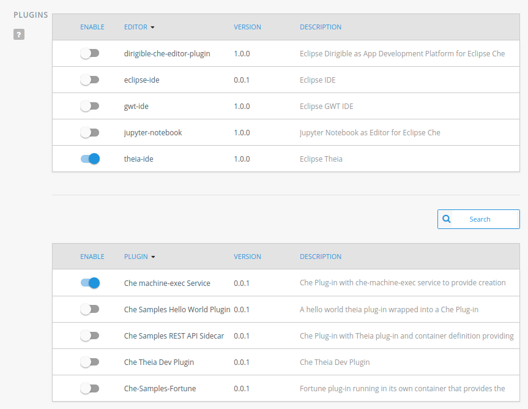

= rh-che dev guide
:toc:
:toc-title:

== Building rh-che
rh-che is a straightforward maven project. For additional information on the build process for the dashboard component, see link:assembly/fabric8-ide-dashboard-war/README.md[README.md] in the dashboard subcomponent.

[NOTE]
====
The rh-che maven build accommodates the same parameters as the upstream maven build
====
[NOTE]
====
The final build artifacts will be available in `+./assembly/assembly-main/target/eclipse-che-*/+`
====

==== Basic build of all components:
[source,bash]
----
mvn clean install
----

==== Build only only one component and dependents (e.g. dashboard component):
[source,bash]
----
mvn clean install -pl ':fabric8-ide-dashboard-war' --amd
----

==== Build, skipping tests and optional checks
Use the `-Pfast` option:
[source,bash]
----
mvn clean install -Pfast
----
This is equivalent to
[source,bash]
----
mvn -DskipTests=true \
    -Dfindbugs.skip=true \
    -Dmdep.analyze.skip=true \
    -Dlicense.skip=true \
    -Dgwt.compiler.localWorkers=2 -T 1C
----
Which can be slightly sped up further by adding `-Dskip-validate-sources -Dskip-enforce`.

==== Add license headers to all files (fix license check step of full build):
[source,bash]
----
mvn license:format
----

==== Format all files (fix check-format step of full build):
[source,bash]
----
mvn fmt:format
----

== Running Selenium Tests
Rh-Che `functional-tests` are based on selenium framework with Guice injection.
These tests require TestNG profile and listener must be set to `com.redhat.che.selenium.core.RhCheSeleniumTestHandler`

Readme from the repository contains further details, including instructions on how to run tests from the docker image:
https://github.com/redhat-developer/rh-che/tree/master/functional-tests

=== VM options
[source,bash]
----
-Dche.threads=1 -Dche.workspace_pool_size=1 -Dche.host="<RH-Che DEPLOYMENT PATH>" -Dche.port=443 \
  -Dche.protocol=https -Dgrid.mode=false -Dbrowser=GOOGLE_CHROME -Ddriver.port=9515 \
  -Ddriver.version="2.35" -DexcludedGroups=github
----

=== Env variables
[source,bash]
----
CHE_INFRASTRUCTURE=openshift;
CHE_TESTUSER_EMAIL=<email>;
CHE_TESTUSER_OFFLINE__TOKEN=<refresh_token>;
CHE_MULTIUSER=true;
CHE_OFFLINE_TO_ACCESS_TOKEN_EXCHANGE_ENDPOINT=https://auth.<OSD URL>/api/token/refresh;
CHE_TESTUSER_NAME=<username>;
CHE_TESTUSER_PASSWORD=<password>;
----

== Creating docker images
[NOTE]
====
The scripts in this section assume that the maven build was completed successfully and that built artifacts exist at `+./assembly/assembly-main/target/eclipse-che-*/eclipse-che-*+`
====

The simplest way to create a docker image locally is to use the provided script:

[source,bash]
----
./dev-scripts/create_docker_image.sh [docker image name and tag]
----
which simply automates copying the built artifacts to the appropriate directory and running a docker build.

Example:
[source,bash]
----
./dev-scripts/create_docker_image.sh
----

will create the image tagged `fabric8/rh-che-server` (the default), while
[source,bash]
----
./dev-scripts/create_docker_image.sh eclipse/che:local
----
will create the image tagged `eclipse/che:local`

== Deploying rh-che

=== Deploying on minishift locally
[CAUTION]
====
When working on minishift, it is helpful to make sure you are working in the VM's docker environment instead of the default. A good practice is to execute
[source,bash]
----
eval $(minishift oc-env)
eval $(minishift docker-env)
----
before proceeding to ensure docker images are pushed to the minishift docker repository.
====
[CAUTION]
====
When working on rh-che locally, using the multi-user version of the addon, the minimum amount of memory the minishift vm should be given is `4GB` (which is the default). This will allow running a single workspace, if that workspace is limited to a max of `1GB` of memory. To increase the memory given to the minishift VM, use the command
[source,bash]
----
minishift start --memory "5GB"
----
Note however that this only takes effect when starting for the first time -- you will have to `minishift delete` the VM first.
====
[NOTE]
====
Currently, the minishift addon supports minishift with OpenShift v3.10.0 or higher. If you have an old VM on your system it is best to `minishift delete` and `rm -rf ~/.minishift`
====
The simplest way to deploy locally is to use the bundled minishift addon:

First, install the prerequisites -- a postgres pod and a keycloak pod, configured with the `standalone-keycloak-configurator`:
[source,bash]
----
minishift addons install ./openshift/minishift-addons/rhche-prerequisites
minishift addons apply rhche-prerequisites
----
this can take a while, as the postgres and keycloak pods can take a fairly long time to start. The `configure-keycloak` pod will likely fail and restart a few times before it can complete.

Once this is done, we can deploy rh-che
[source,bash]
----
minishift addons install ./openshift/minishift-addons/rhche
minishift addons apply rhche \
  --addon-env RH_CHE_DOCKER_IMAGE=[*server image to deploy*] \
  --addon-env RH_CHE_VERSION=[*server tag to deploy*]
----
The additional parameters are optional; by default the image used will be `quay.io/openshiftio/che-rh-che-server:latest` and can easily be changed once deployed by modifying the deployment config yaml.

The minishift addon can be removed via
[source,bash]
----
minishift addon remove rhche
minishift addon remove rhche-prerequisites

minishift addon uninstall rhche
minishift addon uninstall rhche-prerequisites
----
[NOTE]
====
The minishift addon uses the yaml files (`rh-che.app.yaml`, `rh-che.config.yaml`) in `./openshift/minishift-addons/rhche/templates` while the dev-cluster deployment script uses the yaml files in `./openshift`. These templates are slightly different
====


=== Deploying to dev-cluster
[WARNING]
====
The `deploy_custom_rh-che.sh` script requires `yq`, a commandline yaml processor. There are (at least) *two* projects named `yq`:

. There is the Python-based `jq` wrapper: https://github.com/kislyuk/yq
. There is the Go-based `jq` replacement: https://github.com/mikefarah/yq

The Go-based implementation has not been tested and potentially has issues, but the dev-script is confirmed to work with the Python-based `yq` with version `>2.6.0`.
====

A prerequisite for deploying on the dev-cluster is pushing a server image to a repository. Once this is done (and assuming you are logged into the dev-cluster locally), deploying rh-che is simply done by using the `./dev-scripts/deploy_custom_rh-che.sh` script:
[source,bash]
----
./dev-scripts/deploy_custom_rh-che.sh \
    -o $(oc whoami -t) \
    -e [openshift-project-name] \
    -r [docker image] \
    -t [docker tag]
----
this will create / update a project with the display name `RH-Che6 Automated Deployment` and name `[openshift-project-name]`. The `-e`, `-r`, and `-t` parameters are optional.
[NOTE]
====
The dev-cluster deployment script uses the yaml files (`rh-che.app.yaml`, `rh-che.config.yaml`) in `./openshift` while the minishift addon uses the yaml files in `./openshift/minishift-addons/rhche/templates`. These templates are slightly different.
====

=== Deploying to OpenShift in general
To be completed

== Monitoring in production
See link:./documentation/monitoring/monitoring.adoc[Monitoring docs].

== Roll-updating running deployments
Once rh-che has been deployed (whether it's to minishift or the dev-cluster), making changes is done by:

. Building a new docker image
. Pushing it to your repo (on dev-cluster)
** If using minishift it's sufficient to set the env correctly and build
. Running `oc rollout latest rhche` (assuming you're logged in)

== Debugging rh-che
[INFO]
====
By default, Che deployed on OpenShift will have a liveness probe to check container health. This can interfere with debugging in some cases, as the liveness probe checks `/api/system/state` on `wsmaster`. If you encounter this error, the liveness probe can be removed by editing it out of the `rhche` Deployment Config:
[source,bash]
----
$ oc edit dc rhche
# Find the livenessProbe in the yaml; it should look something like
        livenessProbe:
          failureThreshold: 3
          httpGet:
            path: /api/system/state
            port: 8080
            scheme: HTTP
          initialDelaySeconds: 120
          periodSeconds: 10
          successThreshold: 1
          timeoutSeconds: 10
# Delete these lines and the deployment will automatically rollout.
----
====
Enabling debugging in Che is done via the environment variable `CHE_DEBUG_SERVER`. By default, this environment variable is set according to the `remote-debugging-enabled` configmap entry when rh-che is deployed.

For deployments done using the minishift addon, the default is `"true"`; for dev-cluster deployments, the default is `false` but can be enabled by modifying the configmap and rolling out a new deployment.

Once debugging is enabled, the easiest way to link a debugger is by using `oc port-forward`:

. First get the name of the pod running rh-che:
+
[source,bash]
----
$ oc get po
NAME                       READY     STATUS      RESTARTS   AGE
configure-keycloak-j7x2w   0/1       Completed   2          4d
keycloak-1-q5d82           1/1       Running     6          4d
postgres-1-bxwv7           1/1       Running     6          4d
rhche-72-49tt6             1/1       Running     4          19h
----

. Enable port-forwarding to the default debug port:
+
[source,bash]
----
oc port-forward rhche-72-49tt6 8000:8000
----

. Connect your remote debugger to `localhost:8000`

Steps 1 and 2 can be shortcut if only one rh-che pod is present (i.e. you're not in the middle of a rolling deploy / the deploy pod is not there):
[source,bash]
----
oc port-forward $(oc get pods --selector="deploymentconfig=rhche" --no-headers=true -o custom-columns=:metadata.name) 8000
----

=== Debugging wsagent pods (workspaces)
_See also_: link:https://github.com/eclipse/che/wiki/Development-Workflow#debugging-workspace-agent[upstream docs]

To enable debugging of workspace pods, you need to set the env var `WSAGENT_DEBUG=true` in the workspace config dashboard. Additionally, you can optionally set env var `WSAGENT_DEBUG_SUSPEND=true` to suspend wsagent start until a debugger is connected

Once the env var is set, workspace pods are started with wsagent listening on a JPDA debug port (4403 by default). The easiest way to connect to a workspace pod is again by using `oc port-forward`:

[source,bash]
----
oc port-forward <workspace_pod_name> 4403:4403
----
which will allow connecting a remote debugger to `localhost:4403`

A shortcut, if _only a single workspace is running_, is to use a selector to automatically get the pod name:
[source,bash]
----
oc port-forward $(oc get pods --selector="che.workspace_id" --no-headers=true -o custom-columns=:metadata.name) 4403
----

[NOTE]
====
On older versions of OpenShift, it may be also necessary to create a server in the workspace config (in the dashboard) that exposes your JPDA debug port. This is because the JPDA debug server is by default removed from workspaces. It seems that, at least on OpenShift 3.11, you can port-forward to non-exposed ports on a Pod. 
====

== All-in-one build and update commands
These commands will do a full build (skipping tests) of rh-che and rollout a new deployment. They assume that they are being executed from this repositorys root directory, and that environment variables
[source,bash]
----
export DOCKER_IMAGE=fabric8/rh-che
export DOCKER_TAG=local
----
have been set appropriately (i.e. to match whatever is currently deployed). To do a limited build (e.g. if working on the dashboard component only), the maven build command can be modified according to the <<Building rh-che>> section.

=== Minishift
Ensure `eval $(minishift docker-env)` and `eval $(minishift oc-env)` have been executed.
[source,bash]
----
mvn -Pfast -Dskip-enforce -Dskip-validate-sources clean install && \
./dev-scripts/create_docker_image.sh ${DOCKER_IMAGE}:${DOCKER_TAG} && \
oc rollout latest rhche
----

=== Dev-cluster
Ensure you are logged in via `oc` and have push rights to the relevant repository.
[source,bash]
----
mvn -Pfast -Dskip-enforce -Dskip-validate-sources clean install && \
./dev-scripts/create_docker_image.sh ${DOCKER_IMAGE}:${DOCKER_TAG} && \
docker push ${DOCKER_IMAGE}:${DOCKER_TAG} && \
oc rollout latest rhche
----

== Updating `Template` and `ConfigMap` for deployment on various infrastructures

`rh-che` can be deployed on various infrastructures (`minishift`, `dev-cluster`, `dsaas-stg`, `dsaas`). Different set of rules are applied for modifying `Template` / `ConfigMap` depending on the target infrastructure.

=== minishift-addon

The `rhche` minishift-addon is currently the only possible way of deploying `rh-che` locally. The `rh-che.app.yaml` / `rh-che.config.yaml` files from https://github.com/redhat-developer/rh-che/tree/master/openshift/minishift-addons/rhche/templates[./openshift/minishift-addons/rhche/templates] are used for deployment. In order to change the default values, one needs to modify the dedicated `rh-che.app.yaml` / `rh-che.config.yaml` files before applying the addon. Another option would be using `--addon-env` option during applying the `rhche` addon: 

[source,bash]
----
minishift addons apply rhche \
  --addon-env RH_CHE_DOCKER_IMAGE=[*server image to deploy*] \
  --addon-env RH_CHE_VERSION=[*server tag to deploy*]
----

More details about `rhche` minishift addon can be found in the https://github.com/redhat-developer/rh-che/blob/master/dev-guide.adoc#deploying-on-minishift-locally["Deploying on minishift locally"] section.

=== dev-cluster

`rh-che.app.yaml` / `rh-che.config.yaml` files from the https://github.com/redhat-developer/rh-che/tree/master/openshift[./openshift] folder are used for deployment against the `dev-cluster`. Modifying `rh-che.app.yaml` / `rh-che.config.yaml` files is the easiest way of changing the default values before executing the deployment script:

[source,bash]
----
./dev-scripts/deploy_custom_rh-che.sh \
    -o $(oc whoami -t) \
    -e [openshift-project-name] \
    -r [docker image] \
    -t [docker tag]
----


More details can be found in the https://github.com/redhat-developer/rh-che/blob/master/dev-guide.adoc#deploying-to-dev-cluster["Deploying to dev-cluster"] section.

[NOTE]
====
CI job for PR verification, which is triggered via the `[test]` comment, uses the same `rh-che.app.yaml` / `rh-che.config.yaml` files from the https://github.com/redhat-developer/rh-che/tree/master/openshift[./openshift] folder for deployment against the https://dev.rdu2c.fabric8.io:8443/console/[dev-cluster] and further test execution.
====

=== dsaas / dsaas-stg (prod / prod-preview)

`rh-che` has the following deployment cycle on `dsaas` / `dsaas-stg` (prod / prod-preview), which is pretty much the same for all the `openshift.io` services:

- deployment on `dsaas-stg` (prod-preview) happens automatically after each commit to the master branch of the https://github.com/redhat-developer/rh-che[rh-che] repository.
- deployment on `dsaas` (prod) is powered by the https://github.com/openshiftio/saas-openshiftio[saas-openshiftio]. In order to update the production, one needs to change the https://github.com/openshiftio/saas-openshiftio/blob/master/dsaas-services/rh-che6.yaml#L2[hash], which corresponds to the https://github.com/redhat-developer/rh-che/commits/master[commit] hash from the master branch of the https://github.com/redhat-developer/rh-che[rh-che] repository. Once the hash is changed and the corresponding commit is merged to the https://github.com/openshiftio/saas-openshiftio/[saas-openshiftio] `master` branch, new `rhche` deployment will be rollout to production.

[NOTE]
====
The same https://github.com/redhat-developer/rh-che/blob/master/openshift/rh-che.app.yaml[rh-che.app.yaml] openshift template is used for `rh-che` deployment on both `dsaas-stg / dsaas` (prod-preview / prod). One should be really carefull with the template update, since it would affect production regardless of the https://github.com/openshiftio/saas-openshiftio/blob/master/dsaas-services/rh-che6.yaml#L2[hash] commit defined in the https://github.com/openshiftio/saas-openshiftio/blob/master/dsaas-services/rh-che6.yaml[saas-openshiftio] (each time during the rollout update, the template is used directly from the master branch of the original repository). However, `ConfigMap` https://github.com/redhat-developer/rh-che/blob/master/openshift/rh-che.config.yaml[rh-che.config.yaml] is `NOT` used for deployment on `dsaas-stg / dsaas` (prod-preview / prod). In order to update the `ConfigMap` one needs to create a dedicated HK (housekeeping) issue and ask someone from SD (Service Delivery) team to apply new `ConfigMap` values on `dsaas-stg / dsaas`. Example of the HK https://gitlab.cee.redhat.com/dtsd/housekeeping/issues/2527[issue].
====

== che-plugin-registry

https://github.com/eclipse/che-plugin-registry[che-plugin-registry] is a standalone service which provides metadata about the available Che plugins - https://che-plugin-registry.openshift.io/v3/plugins/

.plugins.json
[source,json]
----
[
  {
    "description": "Eclipse Theia, get the latest release each day.",
    "displayName": "theia-ide",
    "id": "eclipse/che-theia/7.0.0-rc-3.0",
    "links": {
      "self": "/v3/plugins/eclipse/che-theia/7.0.0-rc-3.0/"
    },
    "name": "che-theia",
    "publisher": "eclipse",
    "type": "Che Editor",
    "version": "7.0.0-rc-3.0"
  }
]
----

This metadata is consumed and exposed by the UD (User Dashboard) for choosing the plugins during workspace creation:



`che-plugin-registry` is deployed on `dsaas-stg / dsaas` (prod-preview / prod) separately from `rh-che` and has its own deployment cycle (which is pretty much the same for all the `openshift.io` services):

- deployment on `dsaas-stg` (prod-preview) happens automatically after each commit to the master branch of the https://github.com/eclipse/che-plugin-registry[che-plugin-registry] repository.
- deployment on `dsaas` (prod) is powered by the https://github.com/openshiftio/saas-openshiftio/blob/master/dsaas-services/che-plugin-registry.yam[saas-openshiftio]. In order to update the production, one needs to change the https://github.com/openshiftio/saas-openshiftio/blob/master/dsaas-services/che-plugin-registry.yaml#L2[hash], which corresponds to https://github.com/eclipse/che-plugin-registry/commits/master[commit] hash from the master branch of the original https://github.com/eclipse/che-plugin-registry[che-plugin-registry] repository. Once the hash is changed and the corresponding commit is merged to the https://github.com/openshiftio/saas-openshiftio/blob/master/dsaas-services/che-plugin-registry.yaml#L2[saas-openshiftio], new `che-plugin-registry` deployment will be rollout to production.

[NOTE]
====
The same https://github.com/eclipse/che-plugin-registry/blob/master/openshift/che-plugin-registry.yml[che-plugin-registry.yml] openshift template, defined in the original repository, is used for `che-plugin-registry` deployment on both `dsaas-stg / dsaas` (prod-preview / prod). One should be really carefull with the template update, since it would affect production regardless of the https://github.com/openshiftio/saas-openshiftio/blob/master/dsaas-services/che-plugin-registry.yaml#L2[hash] commit defined in the https://github.com/openshiftio/saas-openshiftio/blob/master/dsaas-services/che-plugin-registry.yam[saas-openshiftio] (each time during the rollout update, the template is used directly from the master branch of the original repository).
====

== How to get edit right in the *-che namespace
Users created by standard way don't have write access to the ``<username>-che`` namespace. To obtain these rights, add the user ID to the Toggle and update tenant.

=== Add user to Toggle
Send a request to ```https://api.openshift.io/api/users``` to obtain an information about the user. It is recommended to search for user by username.
The exact command can then seem like that:
```
curl -s --header 'Accept: application/json' -X GET "https://api.openshift.io/api/users?filter[username]=<username>" | jq .data[0].id
```
Add this to prod / prod-preview feature toggle to the ``che.edit.rights`` toggle. 

=== Update tenant
For updating the tenant of specific user you need users Bearer token. The refresh have to be done by API call. The description of API can be found here: http://swagger.goa.design/?url=github.com%2Ffabric8-services%2Ffabric8-wit%2Fdesign#
For the update of tenant use this request:
```
curl -s -X PATCH --header 'Content-Type: application/json' --header 'Authorization: Bearer <token>' https://api.openshift.io/api/user/services
```

The update of tenant should be enough to obtain edit right. It is possible to reset tenant by running clean and update commands:
```
curl -s -X DELETE --header 'Content-Type: application/json' --header 'Authorization: Bearer <token>' https://api.openshift.io/api/user/services
curl -s -X PATCH --header 'Content-Type: application/json' --header 'Authorization: Bearer <token>' https://api.openshift.io/api/user/services

```

[NOTE]
====
If the user is provisioned on prod-preview, use ```https://api.prod-preview.openshift.io``` instead the production one.
====
