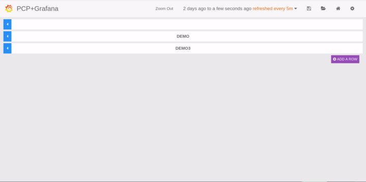
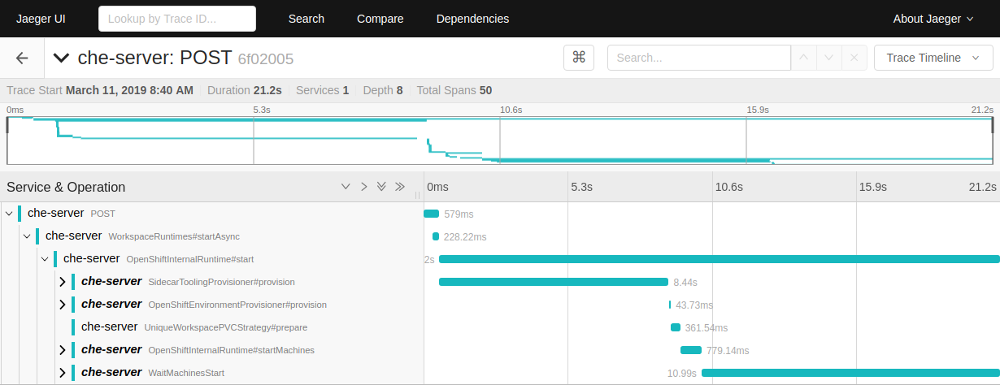

= Monitoring rh-che in production
:toc:
:toc-title:

== General notes
* To obtain access to these resources, you will generally https://gitlab.cee.redhat.com/dtsd/devguide/blob/master/devguide.md#how-to-request-access-to-osio-dev-resources[need to request access].
* General docs on monitoring production are available https://gitlab.cee.redhat.com/dtsd/housekeeping/blob/master/docs/production-logs-dashboard.md[on gitlab]

== Outline
* To view logs, see <<Kibana>>
* To view basic metrics about rhche (e.g. memory/cpu usage), see <<Zabbix>>
* For more detailed (prometheus) metrics, see <<Prometheus>>
* For tracing, see <<Jaeger>>
* For Sentry events, see <<Sentry>>

== Kibana
=== Accessing
To view / search through Che logs, Kibana can be accessed either through the "view archive" link at the top of a pod's log page, or directly via the links

* production: https://logs.dsaas.openshift.com
* staging: https://logs.dsaas-stg.openshift.com

One benefit of using the archives link from the OpenShift console is that the query is pre-filled for the pod you're looking at.

Access to Kibana is granted along with access to the production or staging clusters (see <<General Notes>>).

=== Using
To view Che-specific logs, it's useful to limit the logs query:

* Use `kubernetes.namespace_name:"dsaas-production"` and `kubernetes.namespace_name:"dsaas-preview"` to limit to the relevant namespaces
* Select logs from the Che deployment using either
** `kubernetes.pod_name:"<rhche pod name>"` (where pod name is e.g. `rhche-43-9s87t`), or
** `kubernetes.container_name:"rhche"` to select all stored logs from rhche (instead of just currently running pod).

Further queries can be combined using keywords `AND`, `OR`, and `NOT` to filter so only the relevant logs are shown, e.g.

----
kubernetes.container_name:"rhche" AND kubernetes.namespace_name:"dsaas-production" AND NOT "Web socket session error" AND NOT "Closing unidentified session"
----
can be used to reduce the total number of logs shown.

On the left-hand side next to the shown logs, you can select which fields to show and optionally filter based on their values. By default, the fields shown are `Time` and `_source`, which shows the entire json source for the log. It's usually more useful to select `message` as the shown field, as it's more readable.

Finally, above the query box you can select the time period for logs. This is useful because 1) Kibana will only show you the 500 most recent entries, and 2) it can be used to narrow down the search to the specific time when a problem occurred.

[NOTE]
====
Kibana only stores logs for a few days; it is not possible to go further back in time at the moment.
====

[INFO]
====
If you know a timestamp for the event you are looking for, it is useful to set the time period to start at that timestamp, and change the sort order on the `Time` column to reverse. This will show log messages from your specified start time without having to worry about the 500 entry limit.
====

== Zabbix
=== Accessing
Zabbix is available at https://zabbix.devshift.net:9443/zabbix/index.php. You will need to request access from the SD team.

=== Using
The easiest way to get Che-related metrics is to navigate to `Latest Data`. From here, construct a filter

|====
| Host groups | (blank)
| Hosts | (blank)
| Application | Openshift Project Metrics
| Name | rhche
|====

and press filter to see all rhche-related metrics on both prod and staging. Names generally follow the format `<object>.<metric>[<cluster>,<component>,...]`. For instance, current memory usage for the rhche deployment config is named `dc.memory_usage[dsaas-production,rhche]`

== Prometheus
=== Accessing
Prometheus is accessed via the `osd-monitor` route on production and staging. If you need credentials, ask someone on the team.

The main landing page shows various metrics, including those for `rhche`. Clicking through shows more detail.

=== Using
Che exposes too many prometheus metrics to list directly. To customize the view, it's easiest to navigate to the https://osd-monitor-dsaas-production.09b5.dsaas.openshiftapps.com/grafana/index.html[the main landing page] and add relevant graphs directly:

From here, multiple graphs/queries can be added. Clicking the pencil icon allows entering a query directly without autocomplete. Additional good-to-know things are

* In "Axes & Grid", you can change the scale for the vertical access (e.g. to formatted kB, mB, etc)
* In "Display Styles", selecting "Multiple Series > Stack" will show the metrics stacked (useful for combining multiple series).

== Jaeger
=== Accessing
Jaeger traces are accessed via the `/jaeger` endpoint on the `osd-monitor` route (findable via the OpenShift console). As with access to Prometheus/Graphana, ask someone for credentials.

=== Using
The UI for searching through traces is fairly self-explanatory. Select `che-server` as your service, optionally select an operation / minimum duration (useful for finding e.g. workspace starts, which are longer) and press "Find Traces".

All traces begin with the original API request. This means that searching for e.g. `OpenShiftInternalRuntime#createRoutes` will return traces named `che-server:POST`. Clicking through will show the full trace that _includes_ the create routes span.

Within a trace, spans are organized as a tree, with parent spans representing their own duration as well as the duration of their children. Collapsing spans a few levels deep is useful for getting a high level overview, and clicking on specific spans shows more information (e.g. which server it is waiting )

== Sentry
=== Accessing
Sentry events are available through https://errortracking.prod-preview.openshift.io/. You need need access to the staging cluster to view events. Once you are logged in, join the `openshift_io` team and view the `Che6Master` project to view events relating to Che https://errortracking.prod-preview.openshift.io/openshift_io/che6master/[(or just follow the direct link here)]
