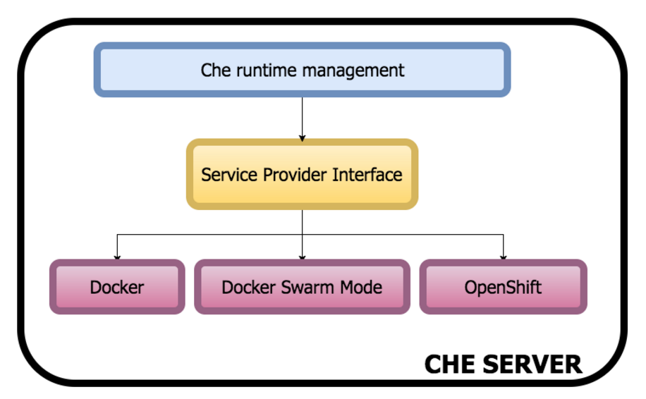
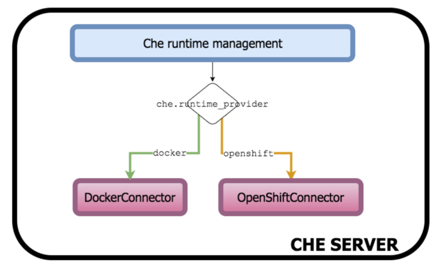
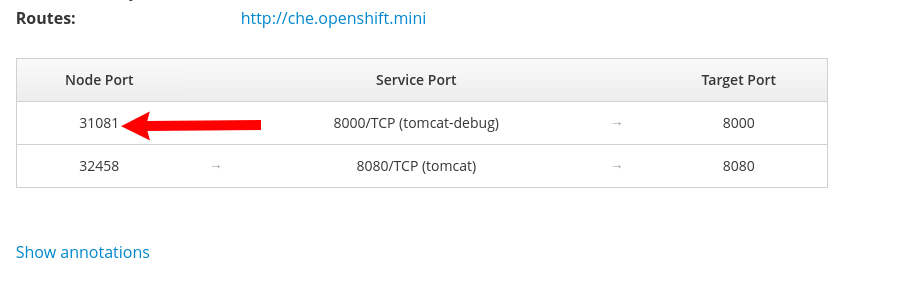
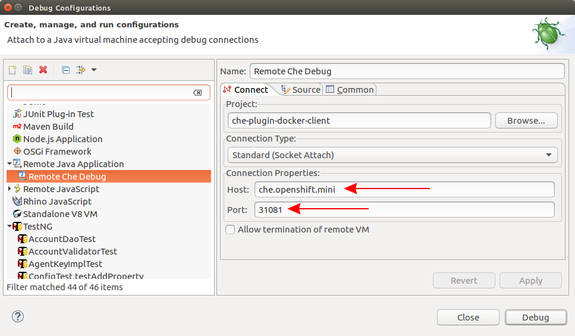

= Openshift integration to Che via SPI

Current plan for OpenShift integration to Che project:

1. Provide PR with initial OpenShift Connector implementation to Che project

2. Implement all OpenShift connector methods

3. Define SPI

[start=4]
4. Refactor OpenShift Connector for using SPI

NOTE: working on item *3* could start before *2* is completed

NOTE: Epic GitHub issue - https://github.com/eclipse/che/issues/5098

== Debugging Che on Minishift

Once Che is deployed you can see that the port for debugging is exposed by `che-host` service: 

Now you can use it for remote debugging in your IDE:

NOTE: Hot swap debugging feature does not work for Eclipse IDE. In order to make changes in the code rebuilding / redeploying image is required

NOTE: More info about Che remote debugging can be found in the document https://github.com/ibuziuk/docs/blob/master/che_remote_debugging.adoc[Eclipse Che - remote debugging setup] 