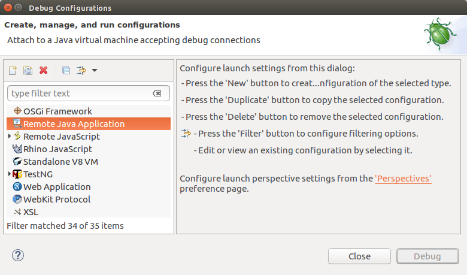
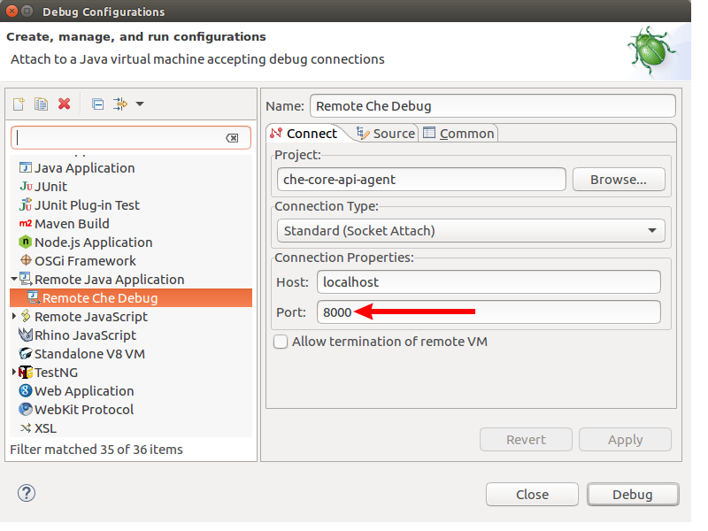
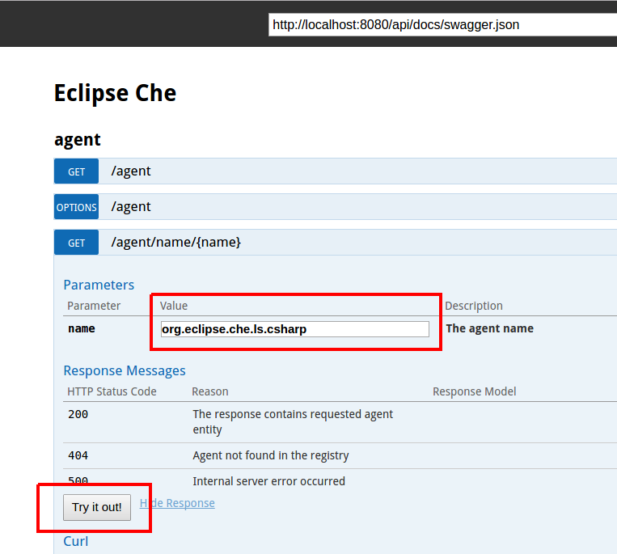
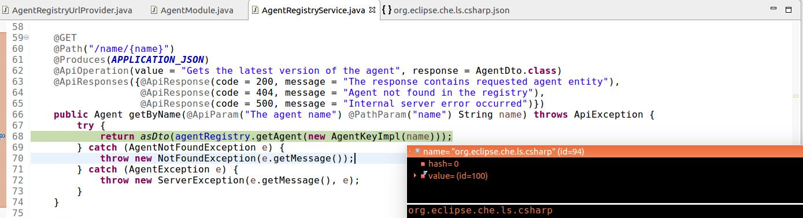

= Remote Debugging setup for Eclipse Che

https://eclipse-che.readme.io/docs/[Eclipse Che] has a really huge codebase which consists of a dozen of individual https://github.com/eclipse/che/wiki/Development-Workflow#modules[modules]. Basically, if you work on a separate module it is utterly convenient to have only this particular module imported to the IDE and setup the remote debugging in order to avoid long-running builds and issues like `java.lang.OutOfMemoryError: GC overhead limit exceeded`. In this article we are going to setup the remote debugging in Eclipse IDE for https://github.com/eclipse/che/tree/master/wsmaster[wsmaster] component. + 
First thing you need to do is to build the component:

....
cd che/wsmaster
mvn clean install
....

After that you need to build the Che assembly: 

....
cd che/assembly
mvn clean install
....

The final step is running the Eclipse Che launcher image with several environment variables:

|===
|Variable | Description

|CHE_DEBUG_SERVER
|The variable for enabling the debug mode. By default port *8000* will be used for JPDA (Java Platform Debugger Architecture)

|CHE_LOCAL_BINARY
|The path to a Che assembly to be used instead of the binary contained within the *che-server* image
|===

NOTE: If port *8000* is already in use you can specify other port for debugging via `CHE_DEBUG_SERVER_PORT` environment variable

NOTE: Make sure that you have the latest version of *eclipse/che* image via `docker pull eclipse/che`

The command itself looks the following way:
....
docker run -t -v /var/run/docker.sock:/var/run/docker.sock -e "CHE_DEBUG_SERVER=true" -e "CHE_LOCAL_BINARY=/home/git/che/assembly/assembly-main/target/eclipse-che-5.0.0-M5-SNAPSHOT/eclipse-che-5.0.0-M5-SNAPSHOT" eclipse/che start
....

NOTE: `CHE_LOCAL_BINARY` value must be amended with a path to assembly specific to your machine

Congratulations - Che is now running on http://localhost:8080/ in the debug mode!

Now it is high time to setup the remote debugging facilities in the Eclipse IDE. First of all, import the https://github.com/eclipse/che/tree/master/wsmaster[wsmaster] component via *File -> Import...-> Existing Maven Projects*. After that create a new *Remote Java Application* Debug Configuration:

NOTE: The *Port* value must be the equal to the `CHE_DEBUG_SERVER_PORT` variable if it was specified in the `docker run` command

Pressing the *Debug* button is the final IDE setup step! +
For the testing purposes you can now navigate to the  http://localhost:8080/swagger and debug the REST endpoints directly from Eclipse:

