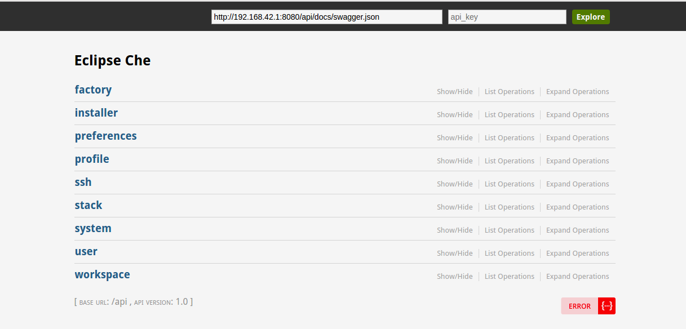
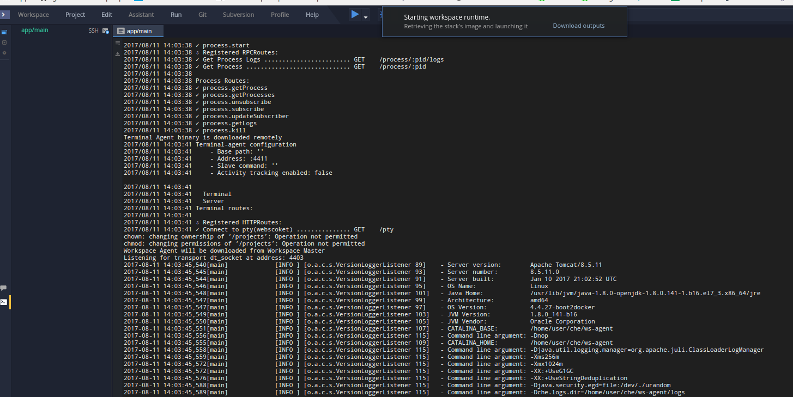
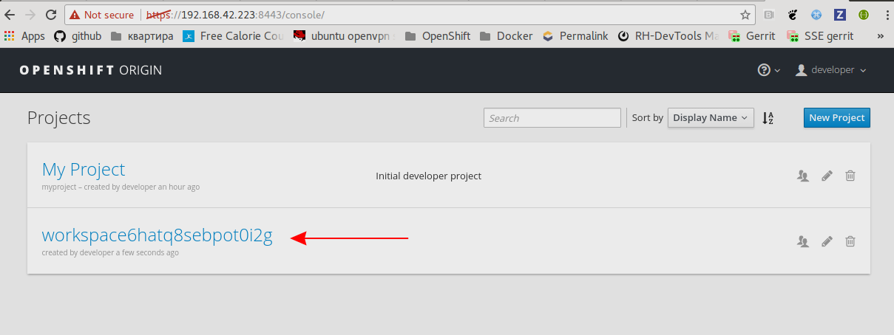
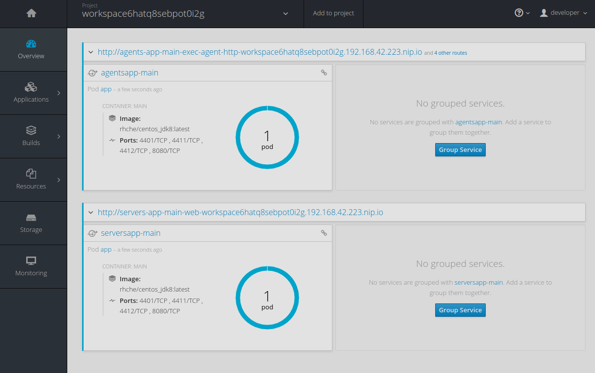

= How to create workspace on minishift using 'openshift' stack type from 'spi' branch?

== Pre-Requirements

Install https://github.com/minishift/minishift#installation[minishift] and start it: 

```bash
minishift start
```

Checkout `spi` branch from https://github.com/eclipse/che[Eclipse Che] repository and update properties in `assembly/assembly-wsmaster-war/src/main/webapp/WEB-INF/classes/codenvy/che.properties`:

```bash
che.infra.openshift.master_url=https://192.168.42.223:8443/
che.infra.openshift.username=developer
che.infra.openshift.password=developer
che.infra.openshift.trust_certs=true

che.infra.openshift.che_server_endpoint=http://${CHE_HOST}:${CHE_PORT}/wsmaster/api
che.infra.openshift.che_server_websocket_endpoint_base=ws://${CHE_HOST}:${CHE_PORT}/wsmaster

che.infra.openshift.machine_start_timeout_min=5

che.infra.openshift.bootstrapper.binary_url=http://${CHE_HOST}:${CHE_PORT}/agent-binaries/linux_amd64/bootstrapper/bootstrapper
```

NOTE: `che.infra.openshift.master_url` is machine specific and can be obtained via `minishift console` command.

== Build 'spi' branch

```bash
mvn clean install -Pfast
```

After that build `eclipse/che-init` and `eclipse/che-server` images by running `build.sh` script from `dockerfiles/init` and `dockerfiles/che` accordingly.

== Run Che

Now you can start Che using the following command:

```bash
docker run -it --rm -e "CHE_DEBUG_SERVER=true" \
                    -e "CHE_HOST=192.168.42.1" \
                    -v /var/run/docker.sock:/var/run/docker.sock \
                    -v /home/user/.che:/data \
                    -v /home/user/code/che:/repo \
                    eclipse/che:nightly start --fast
```
NOTE: `CHE_HOST` can be obtained by running `ifconfig` command. It is IP of machine inside the virtual network for `vbox` which is required for making Che accessible from pods.

image::images/spi/ifconfig.png[width="500", height="300",aption="'ifconfig' output"]

Once che is running you can access swagger API on the http://${CHE_HOST}:8080/swagger/:



NOTE: Dashboard is excluded from `spi` branch for now

== Create workspace using 'openshift' stack

Now you can create workspace via `POST /workspace` swagger endpoint. As `body` parameter specify the following workspace config:

```bash
{
   "defaultEnv":"default",
   "environments":{
      "default":{
         "warnings":[

         ],
         "machines":{
            "app/main":{
               "installers":[
                  "org.eclipse.che.exec",
                  "org.eclipse.che.terminal",
                  "org.eclipse.che.ws-agent"
               ],
               "servers":{
                  "web":{
                     "protocol":"http",
                     "port":"8080/tcp"
                  }
               },
               "attributes":{

               }
            }
         },
         "recipe":{
            "contentType":"application/x-yaml",
            "type":"openshift",
            "content":"kind: List\nitems:\n-\n  apiVersion: v1\n  kind: Pod\n  metadata:\n    name: app\n  spec:\n    containers:\n      -\n        image: rhche/centos_jdk8:latest\n        name: main\n        ports:\n          -\n            containerPort: 8080\n            protocol: TCP"
         }
      }
   },
   "commands":[

   ],
   "projects":[

   ],
   "name":"default"
}
```

== Start workspace

To start the workspace open the IDE using the following URL http://${CHE_HOST}:8080/che/default



NOTE: To start workspace aftomatically after creation set `start-after-create` to `true` in swagger.

Once workspace is started you can open minishift in browser (`minishift console`) and find newly created workspace project:




